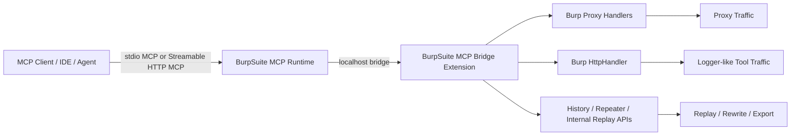
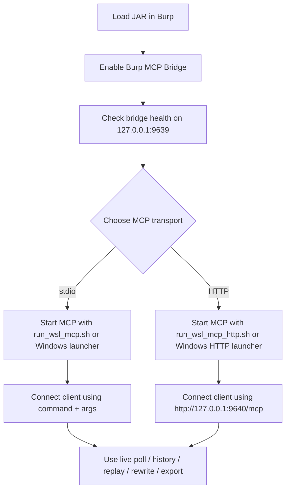

# BurpSuite MCP Bridge

**Simple MCP connectivity for Windows Burp Suite, WSL, Agent-AI, Codex, MCP CLI, and IDE workflows.**

BurpSuite MCP Bridge is built for the real-world case where Burp runs on Windows while AI agents, CLIs, and IDEs need fast, low-noise access to traffic, replay, and automation features — without fighting cross-environment setup.

---

## Why this project stands out

### Minimal setup, practical workflows
- Load **one Burp JAR**
- Start **one MCP runtime**
- Connect from **WSL**, **Windows**, **Codex**, **Agent-AI**, **IDE**, or **MCP CLI**

### Designed for mixed environments
- **Windows Burp + WSL Codex**
- **Windows Burp + Windows MCP clients**
- **Proxy traffic + internal Burp HTTP tool traffic**

### Built for agent-assisted testing
- low-noise traffic polling
- replay with safe mutations
- temporary request / response rewrite rules
- Repeater handoff
- full raw bundle export when bodies are too large to inline

---

## Feature snapshot

| Area | Capability |
|---|---|
| Burp traffic | Live Proxy polling, selective history search, per-flow detail |
| Internal Burp traffic | Logger-like capture for Repeater, Intruder, Scanner, and extension-issued HTTP traffic |
| AI operations | Replay captured requests, mutate headers/path/body, create temporary rewrite rules |
| Safety | Loopback-only bridge, bounded workers/queues, preview-first body handling, raw bundle export |
| MCP transports | **stdio MCP** and **Streamable HTTP MCP** |
| Target environments | WSL, Windows CLI, IDEs, Agent-AI clients |

---

## Architecture



### What each layer does

- **Burp extension**
  - exposes a localhost bridge
  - captures Proxy traffic
  - captures Burp internal HTTP tool traffic
  - applies temporary request/response rewrite rules
  - performs internal replay and Repeater handoff
- **MCP runtime**
  - translates MCP tool calls into bridge operations
  - supports stdio MCP and Streamable HTTP MCP
- **Client side**
  - Codex, Agent-AI, IDEs, MCP CLI, or any compatible client consume the same tools

---

## Integration flow



---

## 3-minute quick start

### 1) Load the Burp extension

In Burp Suite, load:

```text
burp-plugin/burpsuite-mcp-bridge-latest.jar
```

Recommended Burp Bridge settings:

- Bind host: `127.0.0.1`
- Port: `9639`
- Max live/logger entries: `1500`
- Max body preview bytes: `32768`
- Scope only: `off`
- Ignore static: `on`

### 2) Verify the bridge

```bash
./scripts/check_bridge.sh
```

Expected bridge URL:

```text
http://127.0.0.1:9639
```

### 3) Choose one MCP transport

#### Option A — stdio MCP
Best for local MCP clients using `command + args`.

- WSL / Linux
  - `scripts/run_wsl_mcp.sh`
- Windows
  - `scripts/run_windows_mcp.cmd`
  - `scripts/run_windows_mcp.ps1`

#### Option B — Streamable HTTP MCP
Best for URL-based MCP clients and IDE integrations.

- WSL / Linux
  - `scripts/run_wsl_mcp_http.sh`
- Windows
  - `scripts/run_windows_mcp_http.cmd`
  - `scripts/run_windows_mcp_http.ps1`

Default MCP URL:

```text
http://127.0.0.1:9640/mcp
```

---

## Which transport should you choose?

| Use case | Recommended transport |
|---|---|
| Codex in WSL | **stdio MCP** |
| Windows MCP CLI | **stdio MCP** |
| IDE or agent framework that prefers URL endpoints | **Streamable HTTP MCP** |
| Cross-tool local debugging | **Streamable HTTP MCP** |
| Simplest first setup | **stdio MCP** |

---

## Supported workflows

### Proxy traffic
- low-noise live polling
- selective history search
- per-flow detail retrieval
- safe evidence export

### Internal Burp traffic
Logger-like capture for:
- Repeater
- Intruder
- Scanner
- Burp-internal HTTP requests issued by extensions or replay workflows

### AI-assisted operations
- replay captured requests with header/path/body mutations
- temporary request rewrite rules
- temporary response rewrite rules
- Repeater handoff for manual follow-up

---

## Example MCP client configurations

See:

- `config-examples/codex-config.toml`
- `config-examples/codex-config-windows.toml`
- `config-examples/codex-config-http.toml`
- `config-examples/codex-config-http-windows.toml`
- `config-examples/vscode-mcp.json`

---

## Codex WSL CLI configuration tutorial

This is the recommended first setup for:

- **Windows Burp Suite**
- **Codex running inside WSL**

### Step 1 — Place this release directory somewhere stable

Example:

```text
/mnt/d/tools/burpsuite-mcp-bridge-release
```

### Step 2 — Load the Burp extension

In Burp, load:

```text
burp-plugin/burpsuite-mcp-bridge-latest.jar
```

Recommended Burp Bridge settings:

- Bind host: `127.0.0.1`
- Port: `9639`

### Step 3 — Install MCP runtime dependencies inside WSL

```bash
cd /mnt/d/tools/burpsuite-mcp-bridge-release
python3 -m pip install -r requirements-wsl.txt
```

### Step 4 — Verify Burp bridge connectivity

```bash
cd /mnt/d/tools/burpsuite-mcp-bridge-release
./scripts/check_bridge.sh
```

You should see a healthy response for:

```text
http://127.0.0.1:9639/health
```

### Step 5 — Add MCP config to Codex

Edit:

```text
~/.codex/config.toml
```

Append a block like this:

```toml
[mcp_servers.burpsuite-mcp-bridge]
command = "bash"
args = ["/mnt/d/tools/burpsuite-mcp-bridge-release/scripts/run_wsl_mcp.sh"]

[mcp_servers.burpsuite-mcp-bridge.env]
BURP_MCP_BRIDGE_PORT = "9639"
```

If you prefer URL-based MCP instead of stdio, first start:

```bash
cd /mnt/d/tools/burpsuite-mcp-bridge-release
BURP_MCP_BRIDGE_PORT=9639 BURP_MCP_SERVER_PORT=9640 ./scripts/run_wsl_mcp_http.sh
```

Then use:

```toml
[mcp_servers.burpsuite-mcp-bridge]
url = "http://127.0.0.1:9640/mcp"
```

### Step 6 — Restart Codex

After restarting Codex, the bridge should be available as a normal MCP server.

Recommended first checks from the client side:

- `burp_bridge_status`
- `burp_live_poll`
- `burp_history_search`

### Why this setup is useful

- Burp stays on Windows where browser and desktop tooling are easiest to manage
- Codex stays in WSL where shell tooling is strongest
- MCP traffic stays simple and local
- No extra Burp proxy-jar workflow is required

---

## Operational notes

- Burp bridge default: `http://127.0.0.1:9639`
- Streamable HTTP MCP default: `http://127.0.0.1:9640/mcp`
- The Burp bridge accepts **loopback connections only** by default.
- Standard list views return **preview-first body data** rather than full-body inline dumps.
- Full raw request/response bundles can be exported when needed.
- Worker pool and queue are bounded to reduce the chance that MCP-side traffic amplifies Burp stalls.

---

## Tested baseline

- Burp Suite Professional `2025.10.3`
- Target compatibility: Burp / Montoya API versions from the 2025 line onward

---

## Repository layout

```text
burpsuite-mcp-bridge-release/
├─ .codex-plugin/
├─ .mcp.json
├─ README.md
├─ README_CN.md
├─ CHANGELOG.md
├─ CHANGELOG_CN.md
├─ NOTICE.txt
├─ NOTICE_CN.txt
├─ requirements-wsl.txt
├─ assets/
├─ artifacts/
├─ burp-plugin/
├─ config-examples/
├─ scripts/
└─ wsl-mcp/
```

---

## Before you publish

Review and update:

- `.codex-plugin/plugin.json`
- homepage / repository / support URLs
- organization branding and contact information
