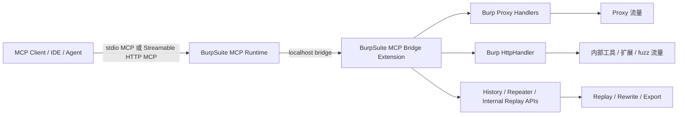
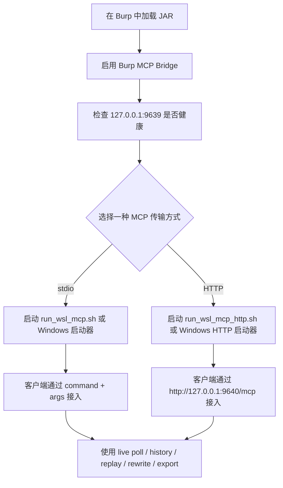

# BurpSuite MCP Bridge

[English](./README.md) | 简体中文

**让 Windows Burp Suite 与 WSL / Windows Agent-AI / Codex / MCP CLI / IDE 进行简单配置即可通信。**

BurpSuite MCP Bridge 面向真实使用场景设计：Burp 跑在 Windows，而 AI Agent、CLI、IDE 或 Codex 需要快速、低噪声地读取流量、执行改包重放，并进行自动化联调。

---

## 为什么这个项目有优势

### 配置简单，接入直接
- 加载 **一个 Burp JAR**
- 启动 **一个 MCP Runtime**
- 从 **WSL**、**Windows**、**Codex**、**Agent-AI**、**IDE**、**MCP CLI** 直接接入

### 面向混合环境
- **Windows Burp + WSL Codex**
- **Windows Burp + Windows MCP 客户端**
- **Proxy 流量 + Burp 内部 HTTP 工具流量**

### 面向 Agent AI 工作流
- 低噪声轮询
- 安全改包重放
- 临时请求 / 响应改写规则
- Repeater 联动
- 大响应体场景下导出完整原始包

---

## 功能速览

| 领域 | 能力 |
|---|---|
| Burp 流量 | 实时 Proxy 轮询、历史搜索、按 flow 拉详情 |
| Burp 内部工具流量 | Repeater、Intruder、Scanner、扩展 / replay 产生的 logger-like HTTP 流量 |
| AI 联调 | 改 header/path/body 后重放、临时 request/response rewrite |
| 安全与稳定性 | loopback-only bridge、有界 worker/queue、preview-first body、raw bundle 导出 |
| MCP 传输 | **stdio MCP** + **Streamable HTTP MCP** |
| 目标环境 | WSL、Windows CLI、IDE、Agent-AI 客户端 |

---

## 架构图



### 各层作用

- **Burp 扩展层**
  - 暴露本地 bridge
  - 捕获 Proxy 流量
  - 捕获 Burp 内部 HTTP 工具流量
  - 执行请求 / 响应自动改写规则
  - 执行内部 replay 与 Repeater 联动
- **MCP Runtime 层**
  - 把 MCP tool call 转换成 bridge 操作
  - 同时支持 stdio MCP 与 Streamable HTTP MCP
- **客户端层**
  - Codex、Agent-AI、IDE、MCP CLI 等都可复用同一套工具能力

---

## 接入流程图



---

## 3 分钟快速开始

### 1）加载 Burp 扩展

在 Burp Suite 中加载：

```text
burp-plugin/burpsuite-mcp-bridge-latest.jar
```

推荐 Burp Bridge 设置：

- Bind host: `127.0.0.1`
- Port: `9639`
- Max live/logger entries: `1500`
- Max body preview bytes: `32768`
- Scope only: `off`
- Ignore static: `on`

### 2）检查 Bridge 是否连通

```bash
./scripts/check_bridge.sh
```

默认 Bridge 地址：

```text
http://127.0.0.1:9639
```

### 3）选择一种 MCP 接入方式

#### 方案 A：stdio MCP
适合需要 `command + args` 的本地接入方式。

- WSL / Linux
  - `scripts/run_wsl_mcp.sh`
- Windows
  - `scripts/run_windows_mcp.cmd`
  - `scripts/run_windows_mcp.ps1`

#### 方案 B：Streamable HTTP MCP
适合 URL 直连 MCP 的客户端和 IDE。

- WSL / Linux
  - `scripts/run_wsl_mcp_http.sh`
- Windows
  - `scripts/run_windows_mcp_http.cmd`
  - `scripts/run_windows_mcp_http.ps1`

默认 MCP 地址：

```text
http://127.0.0.1:9640/mcp
```

---

## 应该选哪种传输方式？

| 场景 | 推荐 |
|---|---|
| WSL 里的 Codex | **stdio MCP** |
| Windows MCP CLI | **stdio MCP** |
| 需要 URL 接入的 IDE / Agent 框架 | **Streamable HTTP MCP** |
| 本地多工具联调 | **Streamable HTTP MCP** |
| 想最快先跑通 | **stdio MCP** |

---

## 支持的工作流

### Burp Proxy 流量
- 低噪声实时轮询
- 历史搜索
- 按 flow 拉详情
- 安全导出证据

### Burp 内部工具流量
支持读取 logger-like 内部 HTTP 流量，例如：
- Repeater
- Intruder
- Scanner
- 走 Burp 内部 HTTP 栈的扩展请求或 replay 请求

### AI 联调能力
- 改 header/path/body 后重放请求
- 临时请求改写规则
- 临时响应改写规则
- 发送到 Repeater 做人工补刀

---

## MCP 客户端配置示例

请参考：

- `config-examples/codex-config.toml`
- `config-examples/codex-config-windows.toml`
- `config-examples/codex-config-http.toml`
- `config-examples/codex-config-http-windows.toml`
- `config-examples/vscode-mcp.json`

---

## Codex WSL CLI 配置教程

这是当前最推荐的接入方式之一：

- **Windows 上运行 Burp Suite**
- **WSL 中运行 Codex CLI**

### 第 1 步：把发布目录放到稳定位置

例如：

```text
/mnt/d/tools/burpsuite-mcp-bridge-release
```

### 第 2 步：在 Burp 中加载扩展

加载：

```text
burp-plugin/burpsuite-mcp-bridge-latest.jar
```

推荐 Burp Bridge 设置：

- Bind host: `127.0.0.1`
- Port: `9639`

### 第 3 步：在 WSL 中安装依赖

```bash
cd /mnt/d/tools/burpsuite-mcp-bridge-release
python3 -m pip install -r requirements-wsl.txt
```

### 第 4 步：检查 Burp bridge 是否连通

```bash
cd /mnt/d/tools/burpsuite-mcp-bridge-release
./scripts/check_bridge.sh
```

正常情况下应能访问：

```text
http://127.0.0.1:9639/health
```

### 第 5 步：把 MCP 配置写入 Codex

编辑：

```text
~/.codex/config.toml
```

追加类似下面的配置：

```toml
[mcp_servers.burpsuite-mcp-bridge]
command = "bash"
args = ["/mnt/d/tools/burpsuite-mcp-bridge-release/scripts/run_wsl_mcp.sh"]

[mcp_servers.burpsuite-mcp-bridge.env]
BURP_MCP_BRIDGE_PORT = "9639"
```

如果你希望用 **URL 方式** 而不是 stdio MCP，先启动：

```bash
cd /mnt/d/tools/burpsuite-mcp-bridge-release
BURP_MCP_BRIDGE_PORT=9639 BURP_MCP_SERVER_PORT=9640 ./scripts/run_wsl_mcp_http.sh
```

然后在 Codex 配置里写：

```toml
[mcp_servers.burpsuite-mcp-bridge]
url = "http://127.0.0.1:9640/mcp"
```

### 第 6 步：重启 Codex

重启后，这个桥接就会作为普通 MCP server 出现在客户端里。

推荐先测试这几个工具：

- `burp_bridge_status`
- `burp_live_poll`
- `burp_history_search`

### 这种方式为什么适合实际使用

- Burp 留在 Windows，便于浏览器和桌面调试
- Codex 留在 WSL，便于 shell、脚本和工具链联动
- MCP 通信链路清晰、简单、本地化
- 不需要额外套用 Burp 官方的 proxy-jar 工作流

---

## 运行说明

- Burp Bridge 默认地址：`http://127.0.0.1:9639`
- Streamable HTTP MCP 默认地址：`http://127.0.0.1:9640/mcp`
- Burp Bridge 默认只接受 **loopback 本机请求**
- 普通列表结果默认返回 **preview-first** 的 body 信息，而不是整包内联
- 需要完整 request/response 时，可以导出 raw bundle
- worker pool 和队列有上限，减少 MCP 请求进一步放大 Burp 卡顿的风险

---

## 已验证基线

- Burp Suite Professional `2025.10.3`
- 目标兼容：2025 以来的 Burp / Montoya API 主线版本

---

## 仓库结构

```text
burpsuite-mcp-bridge-release/
├─ .codex-plugin/
├─ .mcp.json
├─ README.md
├─ README_CN.md
├─ CHANGELOG.md
├─ CHANGELOG_CN.md
├─ NOTICE.txt
├─ NOTICE_CN.txt
├─ requirements-wsl.txt
├─ assets/
├─ artifacts/
├─ burp-plugin/
├─ config-examples/
├─ scripts/
└─ wsl-mcp/
```

---

## 发布前建议检查

请确认以下内容是否已替换为正式信息：

- `.codex-plugin/plugin.json`
- homepage / repository / support URL
- 品牌信息与联系方式
